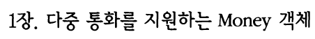
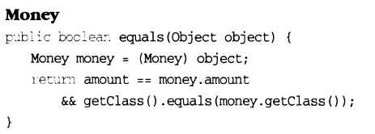

# ch.02 객체의 종류

- VO
    - 값 자체를 나타냄
    - 불변성(참조 객체, 함수도 포함), 동등성, 자가 검증의 특성을 가짐
    - 불변성은 객체를 신뢰할 수 있게 만들기 위함(예측 가능한 방식으로 동작하도록)
        - 멀티스레드 환경에서도 항상 일관되게 동작
    - 어떤 객체가 값이고 상태가 모두 같다면 같은 객체로 봐야 함
        - equals나 hashCode를 오버라이딩 해야 함
    - 생성자에는 반드시 유효한 상태 값이 들어오는지 검증하는 코드가 있어야 함
    - VO의 목적은 신뢰할 수 있고 예측 가능한 객체를 만드는 것
    - cf) TDD의 Money 객체
        - 
        - 
- DTO
    - 다른 객체나 시스템에 데이터를 구조적으로 만들어 전달하기 위한 객체
        - 프로세스타 계층간 데이터 이동에만 사용되는 객체가 아님(데이터 전송이 필요한 모든 곳에서 사용 가능)
        - 게터, 세터가 없어도 내부 데이터 전달이 가능
            - 멤버 변수는 public일 수도 있음
                - getter, setter가 있는 private 멤버 변수는 public 변수와 다를 바 없음
                - getter, setter는 정보 은닉을 깬다.
                - 
        - 데이터베이스에 데이터를 저장하고 불러오는 데만 사용하는 객체가 아님
            - API 통신에 사용되는 요청, 응답 본문에 사용되는 객체도 DTO
- DAO
    - 데이터에 접근하기 위해 만들어진 객체
        - 도메인 로직과 데이터 연결 로직을 분리하기 위한 목적
        - 비즈니스 로직과 데이터 베이스 관련 로직 분리가 필요
- 엔티티
    - 도메인 엔티티
        - 도메인: 비즈니스 영역
        - 도메인 모델: 도메인을 표현하는 개념 모델
        - `식별자가 존재할 수 있고 도메인 모델에 걸맞는 비즈니스 로직을 가질 수 있음`
        - 일반적으로 소프트웨어 개발 분야에서 말하는 엔티티
    - DB 엔티티
        - 데이터베이스 분야에서 어떤 유무형의 객체를 표현하는데 사용하는 용어
    - JPA 엔티티
        - DB 엔티티에 가까운 개념
        - 개발 분야에서 말하는 엔티티와는 거리가 있음
    - 엔티티: 유무형의 자산을 데이터로 표현하기 위해 사용
    - 객체지향 진영에서는 엔티티를 표현하기 위해 '클래스 사용', 데이터베이스 진영에서는 '테이블' 사용(MongoDB는 '도큐먼트')
- 이외에도 영속성 객체(PO), 서비스 객체(SO) 등도 있음 