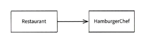

# ch.04 SOLID

- 단일 책임 원칙(SRP: Single Responsibility Principle)
    - 단일 책임 원칙은 클래스에 너무 많은 책임이 할당돼서는 안 되며, 단 하나의 책임만 있어야 한다.
    - 하나의 클래스에 과하게 집중된 책임은 피하고 분할해야 함
    - 단일 책임 원칙은 결국 '변경과 연결되고, 변경으로 인한 영향 범위를 최소화하는 것이 이 원칙의 목적
    - 하나의 클래스를 보고도 각자 의견이 다를 수 있으며, 협업하는 실무 레벨에서 이 원칙을 적용하는 것은 꽤나 어려움
    - 액터 개념이 등장(메시지를 전달하는 주체)
    - 단일 책임 원칙을 이해하려면 책임이 무엇인지 이해하려 노력하기보다는 오히려 액터에 집중해야 함
- 개방 폐쇄 원칙(OCP: Open-Closed Principle)
    - 코드를 확장하고자 할 때 취할 수 있는 최고의 전략은 기존 코드를 아예 건드리지 않는 것
    - OCP의 목표는 확장하기 쉬우면서 변경으로 인한 영향 범위를 최소화하는 것
- 리스코프 치환 원칙(LSP: Liskov Substitution Principle)
    - 기본 클래스의 계약을 파생 클래스가 제대로 치환할 수 있는지 확인하라는 원칙
    - 직사각형 문제외 같이 리스코프 치환 불가 사례 존재 가능
    - 이 경우, 직접 물어봐서 문제를 해결하는 것보다 코드 작성자의 의도를 드러낼 수 있는 조금 더 세련된 방법이 테스트 코드를 사용하는 것임
- 인터페이스 분리 원칙(ISP: Interface Segregation Principle)
    - 어떤 클래스가 자신에게 필요하지 않은 인터페이스의 메서드를 구현하거나 의존하지 않아야 함
    - 인터페이스를 통합하려는 시도는 응집도를 추구하는 행위일 수도 있지만 그것이 곧 응집력이 높아지는 결과로 이어지는 것은 아님
    - 인터페이스 분리 원칙은 역할과 책임을 분리하고 역할을 세세하게 나누라는 의미(기능적 응집도를 추구하라는 의미)
- 의존성 역전 원칙(DIP: Dependency Inversion Principle)
    - 기본 정의
        1. 고수준 모듈은 추상화에 의존해야 한다.
        2. 고수준 모듈이 저수준 모듈에 의존해서는 안 된다.
        3. 저수준 모듈은 추상화를 구현해야 한다.
    - 의존은 곧 결합
    - 의존성과 결합도를 낮추기 위해 의존성 주입 기법 사용
    - 의존성 주입은 의존성 자체를 제거하지 않으며, 의존성을 약화시킴
    - new 사용을 자제하라
        - new 사용하면 추상 타입과 관계없이 고정된 객체를 사용하겠다는 의미
        - 
        - 
    - 인터페이스를 사용함으로써 의존의 방향이 바뀜
- SOLID는 자체는 객체지향이 아니라 객체 지향 '설계'를 추구함
    - SOLID를 지향한다고 객체지향으로 이어지는 것은 아니며, 역할, 책임, 협력을 제대로 이해하고 적절한 구현을 함께 고려해야 함
- 디자인 패턴이 100% 정답은 아님. 디자인 패턴을 외우고 이해하는 것 보다 의존 그래프를 파악하고, 변경으로 인해 영향을 받는 범위가 어디까지인지 확인 해 보며 공부하기