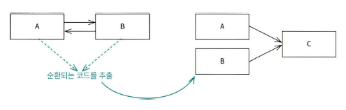
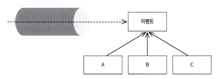

# ch05. 순환 참조

## 순환참조의 문제점

- 무한 루프
    - JSON 직렬화/역직렬화 불가(StackOverFlow 발생)
        - @JsonIdentityInfo 사용하면 되지만 문제를 억지로 해결했다는 느낌
- 시스템 복잡도 증가
    - 멤버가 팀원들의 전체 월급을 조회하는 억지스런 코드 발생 가능성
- 메모리 누수는 자바의 가비지 컬렉션이 잘 처리 하기 때문에 문제는 아님

## 해결책

- 불필요한 참조 제거
    - 단방향 참조
        - 팀원 전체 월급 조회 같은 로직은 서비스에서 처리하면 됨
- 간접 참조 활용
    - ID만 갖고 있다 필요시 활용
        - 쿼리가 조금 늘어나는 것은 시스템에 크게 문제가 되지 않음
- 공통 컴포넌트(기능) 분리
    - 
- 이벤트 기반 시스템 사용
    - 
    - 시스템에 중앙 큐를 구만들고 컴포넌트들이 그것을 구독
    - 스프링에서 ApplicationEvent, ApplicationEventPublisher, EventListener 등 이용
    - 이런 방식의 프로그래밍을 EDP, 이런 설계 방식으로 멀티 시스템 구성하는 방식을 EDA

## 양방향 매핑

```text
순환 참조는 어떻게 해서든 없애는 것이 좋으며, 대부분 없앨 수 있습니다.
순환 참조를 사용하는 데는 정말 신중에 신중을 기해야 하며, 같은 맥락으로 양방향 매핑도 사용할 때 신중에 신중을 기해야 합니다.

양방향 매핑은 도메인 설계를 하다가 '어쩔 수 없이' 나오는 순환 참조 문제에 사용하는 것이 바람직합니다.

하이버네이트 4.3 버전 문서에서는 양방향 매핑을 하이버네이트를 사용하는 모범 사례로 소개합니다J 그래서 의아함을 갖고 그 이유를 읽어보면 ,SQL 쿼리를 만들기 쉽기 때문에'라는 것을 확인할 수 있습니다. 하지만 앞에서 이야기했듯이 양방향 매핑은 순환 참조에 해당합니다. 그러니 가급적 피하는 것이 좋습니다.
```

## 상위 수준의 순환 참조

- 객체 뿐만 아니라 패키지 사이나 시스템 수준에서도 발생 가능

```text
잘 만들어진 패키지는 그 자체로 분리해서 새로운 서비스를 만들 수 있을 정도로 독립적입니다.
```