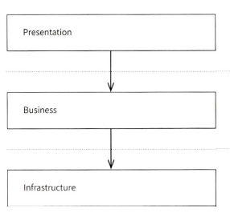
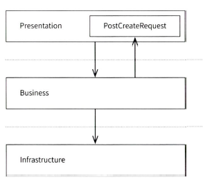
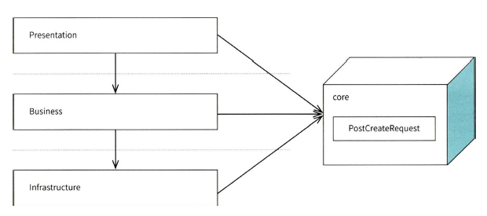
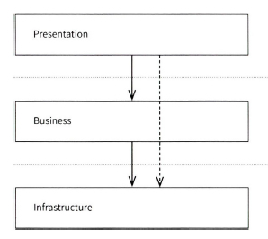

# ch06. 안티패턴

스프링 개발자가 많이 저지르는 구조적 실수들

## 스마트 UI

- 컨트롤러는 스프링에서 UI를 만드는 도구
- UI 수준에 너무 많은 업무 로직이 들어가 있는 것
- 컨트롤러에 비즈니스 로직, 데이터베이스 로직이 있어서는 안 됨
- 빠르게 개발하고 생산성이 높다는 장점도 있긴 함

## 양방향 레이어드 아키텍처

- 레이어드 아키텍처(프레젠테이션 레이어, 비즈니스 레이어, 인프라스트럭처 레이어)
    - 
- 레이어 간 의존 방향이 단방향을 유지하지 않을 때
    - 
    - 비즈니스 레이어에 위치한 서비스 컴포넌트가 프레젠테이션 레이어에 위치한 객체에 의존
    - 레이어가 없어진 거나 마찬가지
    - 해결책은 레이어별로 모델을 따로 만들기(request, command)
        - 
        - 단점은 작성해야할 코드 늘어난다는 것
    - 다른 해결책은 공통 참조 코드를 별도의 모듈로 분리
        - 

## 완화된 레이어드 아키택처

- 상위 레이어에 모든 하위레이어에 접근할 권하는 주는 구조
    - 
    - 기능 개발을 위한 코드가 어디에 어떻게 들어가야 할지 파악 어려움
    - 컨트롤러가 리포지터리를 사용해서는 안 됨

## 트랜잭션 스크립트

- 서비스 컴포넌트의 구현이 어떤 '트랜잭션이 걸려있는 스크립트'를 실행하는 것 같을 때
- 스마트 UI 코드와 다름 없고 비즈니스 로직이 서비스 컴포넌트에 @Transactional 붙은 것뿐
- 객체 지향보다 절차 지향에 가까운 사례

```text
이러한 트랜잭션 스크립트 같은 코드는 서비스의 역할이 무엇인지, 아니면 객체지향을 스프링에 어떻게 적용해야 하는지 모르는 개발자들이 개발할 때 많이 만들어집니다.
```

- 비즈니스 로직의 위치
    - 비즈니스 로직은 도메인 모델에 위치해야 한다

```text
도메인 모델이라는 말이 아직 익 숙하지 않다면 Cafe, Post. Board, User 같은 객체들을 떠올리면 됩니다. 비즈니스 로직은 이러한 객체 들이 갖고 있어야 합니다!
능동적인 객체가 협력하는 것을 강조했던 객체지향을 떠올리면 이것은 당연한 이야기입니다!

트랜잭션 스크립트 같은 코드가 발생하는 이유는 간단합니다.
개발자가 '서비스는 비즈니스 로직을 처리 하는 곳'이라 생각하고 있기 때문입니다.

서비스는 도메인이 협력할 무대만 제공하고 그 이상의 역할을 하지 않는 것이 좋습니다.

제발 비즈니스 로직을 도메인이 처리하게 해주세요.
```