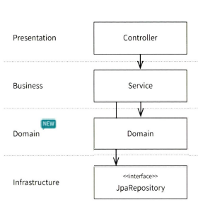
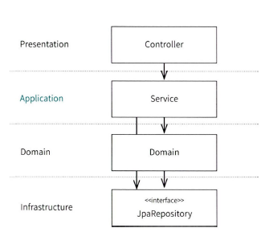
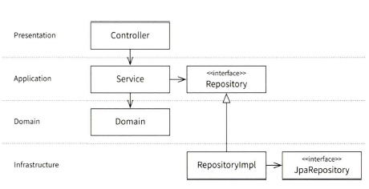
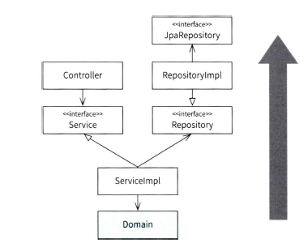

# ch.08 레이어드 아키텍처

## 레이어드 아키텍처의 최소 조건

- 아키텍처: 정책과 제약을 정하는 과정
    - 아키텍처를 적용한다는 것은 제약 조건을 만든다는 것이며, 이를 프로젝트에 적용해 코드를 일관되고 논리적으로 만드는 것
    - 그만큼 제약조건을 이해하는 것이 중요
    - 하지만, 제약조건도 수단일 뿐 반드시 지켜야 하는 것은 아니며, 그것이 아키텍처를 정의하지는 않음
- 레이어드 아키텍처를 위한 최소 제약 조건
    1. 레이어 구조를 사용한다.
    2. 레이어간 의존 방향은 단방향으로 유지한다.

## 잘못된 레이어드 아키텍처

어떤 작업을 먼저할 것인가

### JPA 우선 접근

- 데이터 위주의 사고
- JPA 엔티티를 만들면 결국 SQL 형태로 DDL이 만들어지고 DDL을 어떻게 만들지 고민했다는 것과 다름 없음
- 이 경우 DB 테이블이 먼저 만들어지지 않으면 개발 시작 불가
- 개발의사결정에 데이터베이스가 깊이 관여함(프로그램이 DB에 종속)

### API 엔드포인트 우선 접근

- 하향식 접근법이 JPA 우선 접근보다 시스템에 어떤 것이 필요한지 고민한다는 점에서 낫긴 하지만 이런 방식은 시스템이 특정 프레임워크에 종속되는 결과
    - API 서버, 웹소켓, gRPC 등

### 본질을 다시 생각하기

- 도메인에 따른 기술스택이 결정돼야 함
    - 스프링과 JPA는 세부사항임

## 진화하는 아키텍처

시스템 개발의 첫 시작을 도메인으로 두기

### 인지모델 변경하기

- 도메인 개발은 비즈니스 레이어 개발부터
    - 여기서 비즈니스 레이어는 도메인까지 포함하는 개념
- 우리의 인지 모델에는 도메인이 없는 레이어드 아키텍처만 있었음
  
- 비즈니스 레이어 이름을 도메인 레이어 포함하도록하기 위해 애플리케이션이라는 이름으로 변경(비즈니스 레이어 = 애플리케이션 레이어 + 도메인 레이어)
  
- 이 도메인 레이어는 순수 자바코드로 작성돼야 함(@Entity등 사용 금지)
    - 다른 외부 라이브러리에 종속되지 않게 하기 위해
- `어떤 시스템을 개발할 때 도메인 레이어부터 어떻게 만들지 고민하면 됨`

### JPA와의 결합 끊기

- 의존성 역전 사용해서 특정 기술에 종속되는 것 방지(jdbcTemplate, MyBatis, JPA 등)
  

### 웹 프레임워크와의 결합 끊기

- 프레젠테이션 레이어에 의존성 역전 적용하기
    - 긍정적 의견
        - 경계를 강제할 수 있음
        - 외부 세계와 내부세계에서 벌어지는 모든 일에 일관된 패턴 적용 가능
        - 프레젠테이션에 있는 컴포넌트를 테스트해야 할때 용이
    - 부정적 의견
        - 의존성 역전을 적용했을때 얻을 수 있는 실효성이 모호
        - 의존성 역전을 적용하지 않아도 도메인 모델은 외부세계에 독립적
        - 애플리케이션 레이어가 프레젠테이션 레이어에 의존하는 것이 부자연스러움

## 새로운 접근법

- 도메인부터 개발 시작하기 -> 도메인을 아래에 놓고 위로 올라가는 상향식으로 볼 수 있음

## 빈약한 도메인

- 단순하거나 빈약한 도메인에서 복잡한 아키텍처를 적용하는 건 오버 엔지니어링
