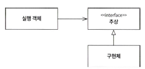
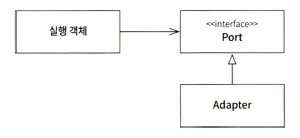
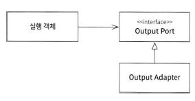
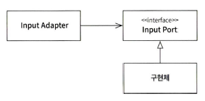
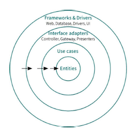

# 부록

## 포트-어댑터 패턴

- 의존성 역전 원칙은 '포트-어댑터 원칙'이라고도 불림
  
  
- 포트 어댑터 패턴에서는 포트를 사용하는 방향에 따라 '출력 포트-출력 어댑터', '입력 포트-입력 어댑터'로 구분해서 부름

### 출력 포트-출력 어댑터

- 실행 객체 입장에서 포트에 메시지를 전달하는 행위가 어떤 새로운 결과를 출력하기 위함
- 포트는 결과를 만드는 '출력 포트', 어댑터는 출력 포트를 구현한 '출력 어댑터'

### 입력 포트-입력 어댑터

- 포트는 외부에 포트의 구현체들을 사용하는 방법을 알려주는 규격

- 포트 어댑터 패턴은 내부 시스템이나 컴포넌트가 외부 시스템과 통신하는 방법을 추상화
- 외부 시스템이 변경되도 내부 시스템에 영향을 주지 않음

## 클린 아키텍처

- 클린 아키텍처에서는 실제 개발 단계에서는 구체적으로 어떤 식으로 개발하는지 설명하지 않음
- 클린 아키텍처가 추상이라면, 헥사고날 아키텍처나 양파 아키텍처는 구현체
